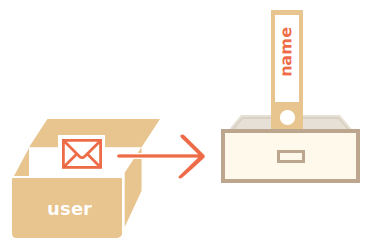
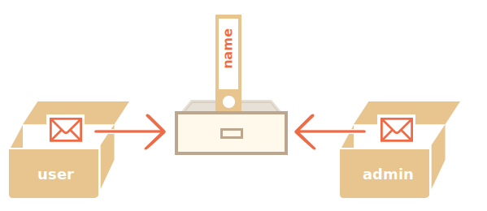

# অবজেক্ট কপি করা, রেফেরেন্স

অবজেক্ট এবং প্রিমিটিভ দের মধ্যে অন্যতম পার্থক্য হলো যে অবজেক্ট গুলি কপি ও সংরখ্যন হয় রেফারেন্স এর মাধ্যমে । 


প্রিমিটিভ মান: স্ট্রিং, সংখ্যা, বুলিয়ানস - "সম্পূর্ণ মান হিসাবে" এসাইন/কপি করা হয়।

যেমন:

```js
let message = "Hello!";
let phrase = message;
```

এর ফলে আমরা দুটি স্বাধীন ভেরিয়েবল আছে, প্রতিটি "হেলো" স্ট্রিংটি সংরক্ষণ করছে ।


অবজেক্ট রা এমন নয়।

** একটি ভেরিএবল অবজেক্ট কে সংরক্ষণ করে না, বরং এর ঠিকানা সংরক্ষণ করে, অন্য কথায় এটির একটি "রেফারেন্স" **

অবজেক্ট এর ছবিঃ 

```js
let user = {
  name: "John"
};
```



এখানে, বস্তুটি মেমোরির কোথাও সংরক্ষণ করা হয়েছে। এবং ভেরিয়েবল `user` এর কাছে এর রেফারেন্স আছে।

** যখন কোনও বস্তুর ভেরিয়েবল কপি করা হয় - রেফারেন্সটি কপি হয়, বস্তুটি নকল হয় না । **

যেমন :

```js no-beautify
let user = { name: "John" };

let admin = user; // রেফারেন্স কপি হলো
```

এখন আমাদের দুটি ভেরিয়েবল রয়েছে, প্রত্যেকেই একই বস্তুর রেফারেন্স:



আমরা এই দুটি ভেরিয়েবল এর যেকোনো টি ব্যাবহার করে অবজেক্ট টি এক্সেস করতে পারি ও এর ভেতরের কন্টেন্ট বা ডেটা গুলি পরিবর্তন করতে পারি।

```js run
let user = { name: 'John' };

let admin = user;

*!*
admin.name = 'Pete'; // এডমিন রেফারেন্সের এর মাধ্যমে পরিবর্তন হলো
*/!*

alert(*!*user.name*/!*); // 'Pete', পরিবর্তন টি "user" রেফারেন্স থেকে দেখা যাচ্ছে
```

উপরের উদাহরণটি প্রমাণ করে যে এখানে কেবল একটি অবজেক্ট রয়েছে। যেন আমাদের একি কক্ষের দুটি চাবি আছে আর আমরা একটি চাবি (`admin`) দিয়ে কক্ষে প্রবেশ করেছি ও অন্যটি (`user`) দিয়ে কক্ষের ভেতরে উকি দিয়েছি।

## রেফারেন্স এর মাধ্যমে তুলনা

ইকুয়ালিটি `==` ও স্ট্রিক্ট ইকুয়ালিটি `===` দুটোই অবজেক্টের ক্ষেত্রে সমানভাবে কাজ করে।

**যদি দুটি অবজেক্ট একই বস্তু হয়, শুধুমাত্র তাহলেই তারা "ইকুয়াল" **

এখানে দুইটি ভেরিএবল একই অবজেক্ট কে রেফারেন্স করে, সুতরাং তারা ইকুয়াল:

```js run
let a = {};
let b = a; // রেফারেন্স কপি হোলো

alert( a == b ); // true, দুটি অবজেক্ট ই সমান
alert( a === b ); // true
```

আর এখানে দুটি অবজেক্ট সমান নয়, যদিও তারা দুজনই খালি :

```js run
let a = {};
let b = {}; // দুটি স্বাধীন অবজেক্ট

alert( a == b ); // false
```

`obj1 > obj2` এর মত তুলনা এর জন্য অথবা কোন প্রিমিটিভ এর সাথে তুলনা করার জন্য `obj == 5`, অবজেক্ট কে প্রিমিটিভ এ রূপান্তর করা হয়। অবজেক্ট গুলোকে কিভাবে তুলনা করা হয় তা সম্পর্কে আমরা শিগ্রই জানব, কিন্তু সত্যি বলতে এই ধরনের তুলনা খুব কমই করা হয়, সাধারণত ভুলক্রমে।

##  ক্লোন করা ও মিলিত করা, Object.assign

তো আমরা জানলাম অবজেক্ট ভেরিএবল কে কপি করলে তা শুধু একটি নতুন রেফারেন্স তৈরি করে।

কিন্তু আমাদের যদি অবজেক্ট এর স্বাধীন নকল বা ক্লোন তৈরি করতে হয় তাহলে আমরা কই করব?

তাও সম্ভব কিন্তু একটু কঠিন, কারণ এই কাজ করার জন্য জাভাস্ক্রিপ্ট এর কোন অন্তর্নির্মিত মেথড নেই।
আসলে এটি খুব কমই প্রয়োজন হয়। রেফারেন্সে কপি করাই বেশিরভাগ সময় যথেষ্ট।

কিন্তু আমরা যদি আসলেই এটি চাই তাহলে আমাদের নতুন একটি অবজেক্ট বানাতে হবে, ও মুল অবজেক্ট টির সম্পূর্ণ কাঠামো কে নকল করে এর সকল প্রপার্টির প্রিমিটিভ স্তরে প্রতিলিতি তৈরি করতে হবে।

যেমন:

```js run
let user = {
  name: "John",
  age: 30
};

*!*
let clone = {}; // নতুন খালি অবজেক্ট 

// এখন user অবজেক্ট এর সকল প্রপার্টি কে clone অবজেক্ট এ কপি করি
for (let key in user) {
  clone[key] = user[key];
}
*/!*


// এখন ক্লোন হচ্ছে একটি স্বাধীন অবজেক্ট যার কন্টেন্ট ইউজার এর সমান 
clone.name = "Pete"; // ডাটা পরিবর্তন করলাম 

alert( user.name ); // মুল অবজেক্ট এ এখনো John
```

আমরা এর জন্য [Object.assign](mdn:js/Object/assign) মেথড টিও ব্যাবহার করতে পারি।

এর সিনট্যাক্স হলো:

```js
Object.assign(dest, [src1, src2, src3...])
```

- প্রথম আর্গুমেন্ট `dest` হলো টার্গেট অবজেক্ট ।
- বাকি আর্গুমেন্ট গুলো `src1, ..., srcN` (যতো প্রয়োজন দেয়া যাবে) হলো মুল অবজেক্ট।
- এটি মুল অবজেক্ট এর সকল প্রপার্টি `src1, ..., srcN` টার্গেট `dest` এ কপি করে। অন্য কথায়, দ্বিতীয় আর্গুমেন্ট থেকে বাকি সকল আর্গুমেন্ট এর প্রপার্টি গুলো প্রথম অবজেক্ট এ কপি হয়।
- এই কল টি `dest` কে রিটার্ন করে।

আমরা এটি ব্যাবহার করে একাধিক অবজেক্টকে একটি অবজেক্ট এ মিলিত করতে পারি:
```js
let user = { name: "John" };

let permissions1 = { canView: true };
let permissions2 = { canEdit: true };

*!*
// permissions1 ও permissions2 এর সকল প্রপার্টি কে user এ কপি করে
Object.assign(user, permissions1, permissions2);
*/!*

// এখন user = { name: "John", canView: true, canEdit: true }
```

কপি করা প্রপার্টি যদি ইতিমধ্যেই থেকে থাকে থাকলে এটি ওভাররাইট হয়ে যাবে:

```js run
let user = { name: "John" };

Object.assign(user, { name: "Pete" });

alert(user.name); // এখন user = { name: "Pete" }
```

আমরা `for..in` এর জায়গায় `Object.assign` ব্যাবহার করে সাধারণ ক্লোনিং করতে পারি :

```js
let user = {
  name: "John",
  age: 30
};

*!*
let clone = Object.assign({}, user);
*/!*
```

এটি `user` এর সকল প্রপার্টি কে খালি অবজেক্ট এ কপি করে তাকে রিটার্ন করে ।

## অভ্যন্তরীণ ক্লোনিং (Nested cloning)

এতক্ষণ পর্যন্ত আমরা ধরে নিয়েছিলাম যে `user` এর সকল প্রপার্টি ই প্রিমিটিভ । কিন্তু প্রপার্টি গুলো তো অন্যান্য অবজেক্ট এর রেফারেন্স ও হতে পারে । সেক্ষেত্রে আমরা কি করবো?

যেমন:
```js run
let user = {
  name: "John",
  sizes: {
    height: 182,
    width: 50
  }
};

alert( user.sizes.height ); // 182
```

এখন এটি `clone.sizes = user.sizes` কে কপি করার জন্য যথেষ্ট নয়, কারণ `user.sizes` হলো একটি অবজেক্ট, এটি রেফারেন্সের মাধ্যমে কপি হবে। সুতরাং `clone` ও `user` একই size শেয়ার করবে:

এমন:

```js run
let user = {
  name: "John",
  sizes: {
    height: 182,
    width: 50
  }
};

let clone = Object.assign({}, user);

alert( user.sizes === clone.sizes ); // true, একই অবজেক্ট

// user এবং clone size কে শেয়ার করে
user.sizes.width++;       // একটি জায়গা থেকে প্রপার্টি পরিবর্তন
alert(clone.sizes.width); // 51, অন্য জায়গায় রেসাল্ট দেখা
```

এটি সমাধান করার জন্য আমাদের একটি ক্লোনিং লুপ ব্যাবহার করা লাগবে যা `user[key]` এর প্রত্যেক মান কে পরীক্ষা করবে, এবং যদি এটি অবজেক্ট হয়, তাহলে এর স্ট্রাকচার কেও কপি করবে। একে বলে "ডিপ ক্লোনিং"।

আমরা রিকার্সন ব্যাবহার করে এটি তৈরি করতে পারি অথবা ইতিমধ্যেই বাস্তবায়িত একটি ব্যাবহার করতে পারি, যেমন [lodash](https://lodash.com) এর [_.cloneDeep(obj)](https://lodash.com/docs#cloneDeep) ফাংশন।

## সংক্ষিপ্ত

অবজেক্ট গুলো রেফারেন্স এর মাধ্যমে কপি হয়। অন্য কথায়, একটি ভেরিয়েবল অবজেক্ট এর মান সংরক্ষণ করে না , বরং একটি রেফারেন্স (মেমোরি এড্রেস) সংরক্ষণ করে। সুতরাং এই ধরনের ভেরিয়েবল কে কপি করলে অবজেক্ট কপি হয় না বরং রেফারেন্স কপি হয়।

কপি করা রেফারেন্সে এর মাধ্যমে করে সকল কাজ (যেমন প্রপার্টি যোগ করা/মোছা) একই অবজেক্ট এ সম্পাদিত হয়।

একটি "বাস্তব কপি" (ক্লোন) তৈরি করতে আমরা ব্যাবহার করতে পারি `Object.assign` যাকে "শ্যালো কপি"(অভ্যন্তরীণ অবজেক্ট রেফারেন্সের মাধ্যমে কপি হয়) বলা হয় অথবা আমরা ব্যাবহার করতে পারি [_.cloneDeep(obj)](https://lodash.com/docs#cloneDeep) এর মত "ডিপ ক্লোনিং" ফাংশন। 
