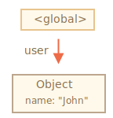
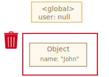
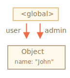
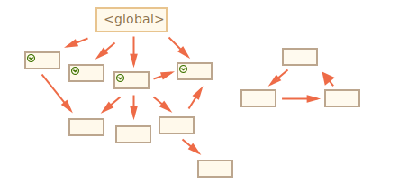

# গারবেজ কালেকশন

জাভাস্ক্রিপ্টে মেমোরি ম্যানেজমেন্ট স্বয়ংক্রিয় ও অদৃশ্যভাবে হয়ে থাকে। আমাদের তৈরি করা প্রিমিটিভ, অবজেক্ট এবং ফাংশন - সবকিছুর জন্য মেমোরি প্রয়োজন হয়।

যখন কোন একটা কিছু আর মেমোরিতে রাখার প্রয়োজন হয় না, তখন আসলে কি ঘটে? কিভাবে জাভাস্ক্রিপ্ট ইঞ্জিন ওগুলোকে খুঁজে বের করে এবং পরিষ্কার করে?

## রিচেবিলিটি

জাভাস্ক্রিপ্টে মেমোরি ম্যানেজমেন্টের মূল ধারণাটি হল *রিচেবিলিটি*।

সহজভাবে বলতে গেলে, "রিচেবল" ভ্যালু হল যাদের এক্সেস করা যায় বা কোন না কোনভাবে ব্যবহার করা যায়। এধরণের ভ্যালুগুলো নিশ্চিতভাবে মেমোরিতে রাখতেই হবে।

1. কিছু সহজাতভাবে রিচেবল ভ্যালু রয়েছে, যাদের সঙ্গত কারণেই মেমোরি থেকে মুছে দেয়া যাবে না।

    উদাহরণস্বরূপঃ

    - বর্তমান ফাংশনের লোকাল ভেরিয়েবল এবং প্যারামিটারসমূহ।
    - অন্যান্য ফাংশন, যেগুলো নেস্টেড কলের বর্তমান চেইনে রয়েছে, তাদের ভেরিয়েবল এবং প্যারামিটারসমূহ।
    - গ্লোবাল ভেরিয়েবল
    - (আরও কিছু আছে, ইন্টারনালি ব্যবহৃত হয় এরকমগুলো সহ)

    এসব ভ্যালুগুলোকে বলা হয় *রুট*.

2. অন্যান্য ভ্যালুগুলোকে রিচেবল ধরা হবে, যদি তারা রুট থেকে কোন রেফারেন্সের মাধ্যমে বা রেফারেন্সের চেইনের মাধ্যমে রিচেবল হয়।

<<<<<<< HEAD:1-js/04-object-basics/02-garbage-collection/article.md
    উদাহরণস্বরূপ, যদি একটি লোকাল ভেরিয়েবলে একটি অবজেক্ট থাকে, এবং ওই অবজেক্টের একটি প্রোপার্টিতে অন্য আরেকটি অবজেক্টের রেফারেন্স থাকে, তাহলে ওই অবজেক্টটি রিচেবল ধরা হবে। এবং সেই অবজেক্টে যতগুলো রেফারেন্স আছে সবগুলো রিচেবল ধরা হবে। বিস্তারিত উদাহরণগুলো নিচে দেয়া হল।
=======
    For instance, if there's an object in a global variable, and that object has a property referencing another object, that object is considered reachable. And those that it references are also reachable. Detailed examples to follow.
>>>>>>> b0464bb32c8efc2a98952e05f363f61eca1a99a2:1-js/04-object-basics/03-garbage-collection/article.md

জাভাস্ক্রিপ্ট ইঞ্জিনে একটি ব্যাকগ্রাউন্ড প্রসেস আছে যাকে বলা হয় [গারবেজ কালেক্টর](https://en.wikipedia.org/wiki/Garbage_collection_(computer_science))। এটি সকল অবজেক্টকে পর্যবেক্ষণ করে এবং যেগুলো আনরিচেবল হয়ে যায় সেগুলো মেমোরি থেকে মুছে দেয়।

## একটি সহজ উদাহরণ

খুবই সহজ একটি উদাহরণঃ

```js
// user এর কাছে অবজেক্টটির রেফারেন্স আছে
let user = {
  name: "John"
};
```



এখানে তীর চিহ্ন দিয়ে অবজেক্টের রেফারেন্স বুঝানো হচ্ছে। গ্লোবাল ভেরিয়েবল `"user"` এর কাছে `{name: "John"}` অবজেক্টের রেফারেন্স আছে (আমরা সংক্ষেপে এটিকে John বলব). John এর `"name"` প্রোপার্টি একটি প্রিমিটিভ সংরক্ষণ করছে, তাই এটিকে অবজেক্টের ভেতরে আঁকা হয়েছে।

যদি `user` কে ওভাররাইট করা হয় তাহলে রেফারেন্সটি হারিয়ে যাবে।

```js
user = null;
```



এখন John আর রিচেবল না। যেহেতু রেফারেন্স হারিয়ে গেছে, এটিকে এক্সেস করার আর কোন উপায় নেই। গারবেজ কালেক্টর এটিকে গারবেজ হিসেবে গণ্য করবে এবং মেমোরি থেকে মুছে দিবে।

## দ্বৈত রেফারেন্স

এখন ধরে নেই আমরা `user` থেকে রেফারেন্সটি `admin` এ কপি করলামঃ

```js
// user এর কাছে অবজেক্টটির রেফারেন্স আছে
let user = {
  name: "John"
};

*!*
let admin = user;
*/!*
```



এখন আমরা যদি আগের মতই রেফারেন্স মুছে দেইঃ
```js
user = null;
```

...তাহলেও অবজেক্টটি গ্লোবাল ভেরিয়েবল `admin` এর মাধ্যমে রিচেবল, সুতরাং এটি মেমোরিতে থাকবে। যদি আমরা `admin` কেও ওভাররাইট করি তাহলেই শুধুমাত্র এটিকে মুছে দেয়া যাবে।

## পরস্পরসংযুক্ত অবজেক্ট

এবার একটু জটিল উদাহরণঃ

```js
function marry(man, woman) {
  woman.husband = man;
  man.wife = woman;

  return {
    father: man,
    mother: woman
  }
}

let family = marry({
  name: "John"
}, {
  name: "Ann"
});
```

`marry` ফাংশনটি দুটি অবজেক্টকে একে অপরের সাথে যুক্ত করে দেয় এবং তৃতীয় একটি অবজেক্ট রিটার্ন করে যেটাতে আগের দুটি অবজেক্টই আছে।

ফলে মেমোরির গঠন এরকম হয়ঃ


এখন পর্যন্ত সবগুলো অবজেক্টই রিচেবল।

দুটি রেফারেন্সকে মুছে দেয়া যাকঃ

```js
delete family.father;
delete family.mother.husband;
```


এই দুটি অবজেক্টের যেকোনো একটিকে মুছে দেয়াই যথেষ্ট নয়, কারণ সবগুলো অবজেক্ট এখনও রিচেবল।

কিন্তু আমরা যদি দুটিকেই মুছে দেই, তাহলে আমরা দেখি যে John কে এক্সেস করার মত আর কোন অন্তর্মুখী রেফারেন্স অবশিষ্ট নেইঃ


বহির্গামী রেফারেন্সে কিছু যায় আসে না। শুধুমাত্র অন্তর্মুখীগুলো একটি রেফারেন্সকে রিচেবল করতে পারে। সুতরাং John এখন আনরিচেবল, তাই এটি এখন তার সব ডাটাসহ, যেগুলো আর এক্সেসেবল না, মেমোরি থেকে মুছে যাবে।

গারবেজ কালেকশনের পরঃ


## আনরিচেবল আইসল্যান্ড

এটিও সম্ভব যে পরস্পর সংযুক্ত একগুচ্ছ অবজেক্ট একসাথে আনরিচেবল হয়ে যাচ্ছে এবং মেমোরি থেকে মুছে যাচ্ছে।

যদি আগে বর্ণিত অবজেক্টের কথাই ধরা হয়, তাহলেঃ

```js
family = null;
```

মেমোরি এখন দেখতে এরকম হবেঃ


রিচেবিলিটির ধারণা কতটা গুরুত্বপূর্ণ তা এই উদাহরণটি দেখলে স্পষ্ট বোঝা যায়।

এটি পরিষ্কার বোঝা যাচ্ছে John এবং Ann এখনও সংযুক্ত, তাদের মধ্যে অন্তর্মুখী রেফারেন্স আছে। কিন্তু এটাই যথেষ্ট নয়।

আগের `"family"` অবজেক্ট রুট থেকে বিচ্ছিন্ন হয়ে গিয়েছে, এটির সাথে আর কোন রেফারেন্স নেই, সুতরাং পুরো অবজেক্টের গুচ্ছটি আনরিচেবল এবং মেমোরি থেকে মুছে যাবে।

## ইন্টারনাল এলগরিদম

সাধারণ গারবেজ কালেকশনের এলগরিদমকে বলা হয় "mark-and-sweep".

নিন্মে বর্ণিত কাজগুলো "গারবেজ কালেকশন" এর সময় নিয়মিত করা হয়ঃ

- গারবেজ কালেক্টর রুট গুলোকে চিহ্নিত করে।
- তারপর সেগুলো থেকে যেসব রেফারেন্সে যাওয়া যায়, সবগুলোতে গিয়ে তাদের চিহ্নিত করে।
- তারপর এটি চিহ্নিত করা অবজেক্টগুলো থেকে *তাদের* রেফারেন্সগুলো চিহ্নিত করে। সবগুলো খুঁজে বের করা অবজেক্টগুলোকে এটি মনে রাখে যাতে ভবিষ্যতে কোন অবজেক্টে দ্বিতীয়বার যেতে না হয়।
- ...এবং এভাবে যতক্ষণ না সবগুলো রিচেবল রেফারেন্স (রুট থেকে) এটি খুঁজে বের করছে, ততক্ষণ উপরের প্রক্রিয়া চলতে থাকে।
- চিহ্নিত করা অবজেক্টগুলো ছাড়া বাকি সব অবজেক্টকে মুছে দেয়া হয়।

উদাহরণস্বরূপ, ধরা যাক আমাদের অবজেক্টের গঠন দেখতে এই রকমঃ


আমরা পরিষ্কারভাবে ডান দিকে "আনরিচেবল রেফারেন্সগুলো" দেখতে পাচ্ছি। এখন দেখা যাক কিভাবে "mark-and-sweep" গারবেজ কালেক্টর এটিতে কাজ করে।

প্রথম ধাপ হল রুট গুলোকে চিহ্নিত করাঃ



তারপর তাদের রেফারেন্সগুলোকে চিহ্নিত করাঃ


...এবং যদি সম্ভব হয়, তাদের রেফারেন্সগুলোকে চিহ্নিত করাঃ


এখন যেসব অবজেক্ট এ যাওয়া যায় না তাদের আনরিচেবল হিসেবে ধরা হবে এবং মেমোরি থেকে মুছে দেয়া হবেঃ


আমরা পুরো প্রক্রিয়াটিকে এভাবে ভাবতে পারি - একটি বড় রঙের বালতি রুট গুলো থেকে ঢেলে দেয়া হল। রঙের ধারা যেসব রেফারেন্সের মাধ্যমে প্রবাহিত হতে পারে সেগুলো রিচেবল। বাকিগুলো আনরিচেবল এবং তাদের মুছে দেয়া হবে।

এটিই হল গারবেজ কালেকশন কিভাবে কাজ করে তার ধারণা। পুরো প্রক্রিয়াটি নিখুঁত ও দ্রুত হওয়ার জন্য এবং যাতে কোড এক্সিকিউশন বাধাগ্রস্ত না হয় তার জন্য জাভাস্ক্রিপ্ট ইঞ্জিন অনেক অপটিমাইজেশন ব্যবহার করে।

কিছু অপটিমাইজেশনঃ

- **জেনারেশনাল কালেকশন** -- অবজেক্টগুলোকে দুইভাগে বিভক্ত করা হয়ঃ নতুন এবং পুরাতন। অনেক অবজেক্ট আছে যেগুলো তৈরি হয়, তাদের কাজ শেষ করে এবং দ্রুতই নিঃশেষ হয়ে যায়, তাদের দ্রুতই মুছে দেয়া যায়। যেসব অবজেক্ট অনেকক্ষণ ধরে প্রয়োজন হয় তাদের রিচেবিলিটি পরীক্ষা করা হয় দেরি করে।
- **ইনক্রিমেন্টাল কালেকশন** -- যদি অনেকগুলো অবজেক্ট থাকে এবং আমরা তাদের প্রত্যেককে একই সাথে খুঁজে বের করে চিহ্নিত করতে চাই, তাহলে বোঝা যাওয়ার মত লম্বা সময় প্রয়োজন হবে। সুতরাং ইঞ্জিন গারবেজ কালেকশনকে ছোট ছোট অংশে ভাগ করার চেষ্টা করে। তারপর এক একটি অংশ আলাদাভাবে এক্সিকিউট করা হয়। এই প্রক্রিয়াতে কিছুটা বেশী হিসেব রাখতে হয়, তাদের মধ্যে কোন পরিবর্তন হচ্ছে কিনা তার জন্য, কিন্তু আমরা অনেকগুলো ছোট ছোট সময়ে কাজটি শেষ করতে পারছি যা একটি লম্বা সময়ের চাইতে ভালো।
- **আইডল-টাইম কালেকশন** --  গারবেজ কালেকশন চেষ্টা করে যাতে শুধুমাত্র যে সময় সিপিইউ অলস বসে আছে সে সময় তার কাজ করার জন্য, এতে কোড এক্সিকিউশনে কোন প্রভাব পড়ার সম্ভবনা কমে যায়।

আরও অনেক অপটিমাইজেশন এবং গারবেজ কালেকশন এলগরিদম রয়েছে। যদিও আমি ওগুলোকে এখানে বলতে চাই, আমার থামতে হবে, কারণ ভিন্ন ভিন্ন ইঞ্জিন ভিন্ন ভিন্ন পদ্ধতি এবং কৌশল অবলম্বন করে। এবং এটাও বোঝা গুরুত্বপূর্ণ, ইঞ্জিনগুলো যত উন্নত হচ্ছে, কৌশলগুলোও পরিবর্তন হচ্ছে, সুতরাং কোন "প্রয়োজন" ছাড়া প্রথমেই একদম গভীরভাবে জানার চেষ্টা করা সমুচিন মনে হয় না। অবশ্য এটি সম্পূর্ণভাবে আপনার আগ্রহের উপর নির্ভর করে, তাই নিচে আপনার জন্য কিছু লিঙ্ক থাকছে।

## সারাংশ

প্রধানত যেসব বিষয় জানতে হবেঃ

- গারবেজ কালেকশন স্বয়ংক্রিয়ভাবে হয়। আমরা এটিকে জোর করে চালাতে বা বন্ধ করতে পারি না।
- অবজেক্টগুলো মেমোরিতে থাকবে যদি রিচেবল হয়।
- অন্তর্মুখী রেফারেন্স থাকা মানেই রিচেবল (রুট থেকে) নয়ঃ একদল পরস্পর সংযুক্ত অবজেক্ট একসাথে আনরিচেবল হতে পারে।

আধুনিক ইঞ্জিনগুলো গারবেজ কালেকশনের জন্য অনেক উন্নত এলগরিদম ব্যবহার করে।

"The Garbage Collection Handbook: The Art of Automatic Memory Management" (R. Jones et al) এই বইটি এধরণের কিছু এলগরিদম নিয়ে আলোচনা করে।

আপনি যদি লো-লেভেল প্রোগ্রামিং এ অভ্যস্থ হন, এই আর্টিকেলে V8 গারবেজ কালেক্টর নিয়ে অনেক বিস্তারিত তথ্য পাবেন [A tour of V8: Garbage Collection](http://jayconrod.com/posts/55/a-tour-of-v8-garbage-collection).

[V8 ব্লগ](https://v8.dev/) বিভিন্ন সময় মেমোরি ম্যানেজমেন্টের পরিবর্তন সম্পর্কে প্রবন্ধ প্রকাশ করে। প্রকৃতপক্ষে, গারবেজ কালেকশন নিয়ে জানতে হলে আপনাকে সাধারণত V8 এর অভ্যন্তরীণ বিষয়াদি জানতে প্রস্তুতি নিতে হবে এবং [Vyacheslav Egorov](http://mrale.ph) এর ব্লগ পড়তে হবে, যিনি V8 এ একজন ইঞ্জিনিয়ার হিসেবে কাজ করেছেন। আমি শুধু "V8" বলছি, কারণ ইন্টারনেটে এটির রিসোর্স সবচাইতে বেশী। অন্যান্য ইঞ্জিনের ক্ষেত্রে, অনেক কৌশল একই রকমের, কিন্তু গারবেজ কালেকশনের অনেক বৈশিষ্ট্য আলাদা।

ইঞ্জিন সম্পর্কে গভীর জ্ঞ্যান খুবই ভাল, যদি আপনার লো-লেভেল অপটিমাইজেশন প্রয়োজন হয়। ভাষা সম্পর্কে জানার পরে এ বিষয়ে পড়াশুনা করার প্রস্তুতি নেয়া ভালো পদক্ষেপ হবে।